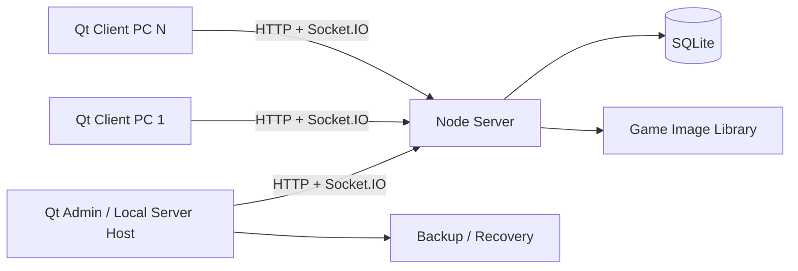

# معماری

## قرارداد لایه‌ها

- **Server صاحب حقیقت است:** کاربر، نشست، اعتبار، بدهی، سفارش و ledger فقط در server تغییر می‌کنند.
- **Client نمایش و فرمان است:** هیچ محاسبه مالی نهایی در QML معتبر نیست.
- **Admin فرمان عملیاتی است:** پس از mutation، response معتبر و سپس socket event یا refetch.
- **SQLite:** عملیات مالی و تغییر نشست باید transaction اتمیک داشته باشند.

## Real-time

- `client:register`, `client:login`, `client:logout`
- `clients:update`, `credits:update`, `session:end`
- `games:update`, `order:new`, `settings:update`
- `admin:message`, `admin:force-login`, `admin:power`

هر event باید:

1. نسخه/shape مشخص داشته باشد.
2. idempotent یا دارای event id باشد.
3. پس از ثبت DB منتشر شود، نه قبل از آن.
4. در reconnect با snapshot HTTP قابل بازسازی باشد.

## مرزهای امنیتی

- kiosk hook دفاع UX است، نه مرز امنیتی کامل.
- endpointهای حساس نیازمند JWT، permission و audit هستند.
- IP allowlist فقط لایه اضافی است و جای احراز هویت را نمی‌گیرد.
- secretها و رمزها نباید hardcode یا commit شوند.

## Reliability

- session heartbeat و stale-session recovery.
- ledger immutable و balance قابل بازسازی.
- backup دوره‌ای و restore test.
- crash log برای server، admin و client.
- release باید health check و rollback داشته باشد.
